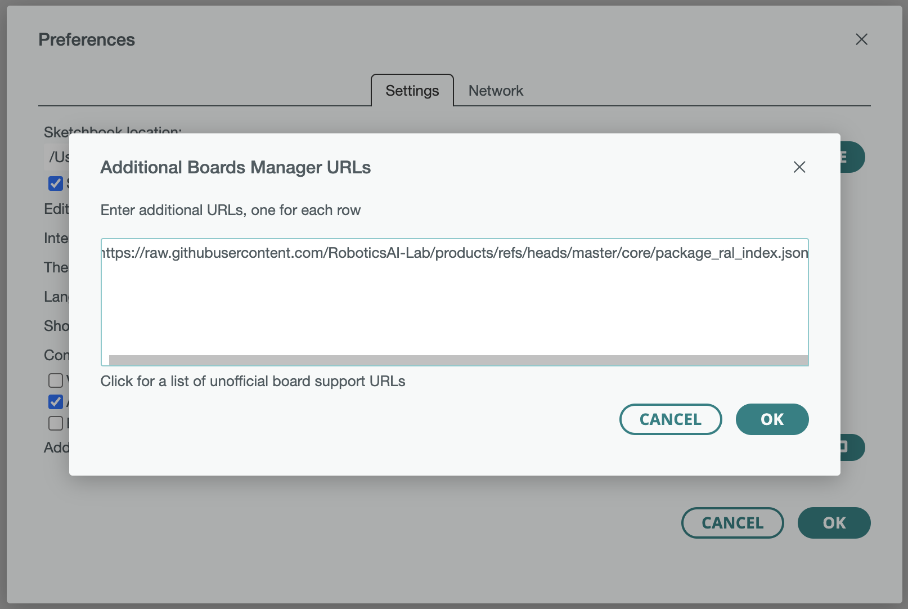
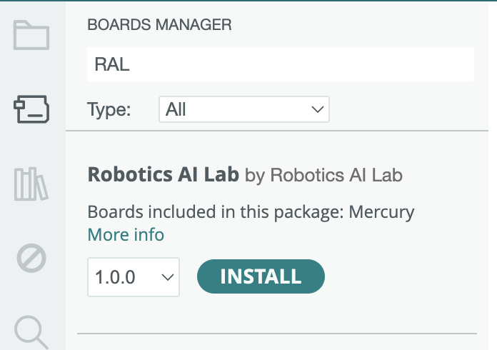
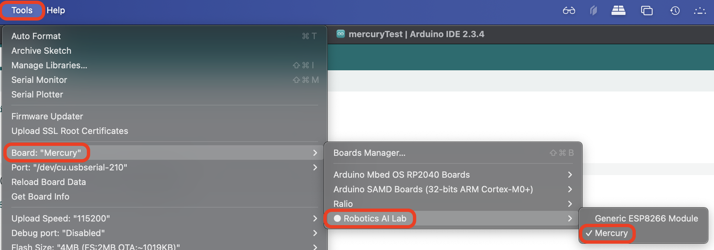

Mercury Development Board
===========================================

# Support for Arduino® IDE
Download the latest stable version of Arduino IDE (2.x.x and above) from the [Arduino website](https://www.arduino.cc/en/software).

### Installing with Boards Manager

- Start Arduino and open the Preferences window.
- Enter the below .json file link into the *File > Preferences > Additional Boards Manager URLs* field of the Arduino IDE.
  ```json
  https://raw.githubusercontent.com/RoboticsAI-Lab/products/refs/heads/master/core/package_ral_index.json
  ```
- You can add multiple URLs, separating them with commas.

### Initiating Flashing ###
To initial code upload, *press and hold* "FLASH" button towards the bottom left of the board when you see "Connecting..." in Arduino IDE terminal.
Let go off the FLash button once the code starts to upload.



- Open Boards Manager from Tools > Board menu and install *Robotics AI Lab* platform.



- Select appropriate Mercury board from Tools > Board menu after installation.



___

For more information please refer to [Additional Documentation](https://github.com/esp8266/Arduino/tree/master?tab=readme-ov-file).

___
